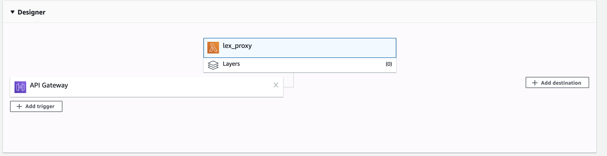

# Wether check serverless (AWS Lex, Lambda and API Gateway)

The goal of this website is to support the learning of the Building Serverless Applications course.


### Application rendering

### AWS Lambda functions:

## Get weather

````
function handler(event, context, callback){
    var 
        AWS = require("aws-sdk"),
        DDB = new AWS.DynamoDB({
            apiVersion: "2012-08-10",
            region: "us-east-1"
        }),
        
        city_str = event.city_str.toUpperCase(),
        data = {
            city_str: city_str,
            temp_int_str: 72
        },
        response = {},
        params = {
            TableName: "weather",
            KeyConditionExpression: "sc = :v1",
            ExpressionAttributeValues: {
                ":v1":{
                    S: city_str
                }
            }
        };
    
   	DDB.query(params, function(err, data){
       var
       		item = {},
           	response = {
            	statusCode: 200,
            	headers: {},
            	body: null
        	};
        if(err){
            response.statusCode = 500;
            console.log(err);
            response.body = err;
        }else{
            // console.log(data.Items[0]);
            var data = data.Items[0];
            if(data && data.t){
                console.log(data.sc.S + " and " + data.t.N);
            	item = {
                    temp_int:Number(data.t.N),
                    city_str: data.sc.S
            	};
            }else{
                item = {
                	city_str: event.city_str
                  //when we don't return a temp, the client can say city not found
            	};
            }
        }
        response = item;
       // console.log(response);
        callback(null, response);
    });
}
exports.handler = handler;

### AWS Lex test code




````
 function handler(event, context, callback){      
      var 
          MESSAGE_STR = event.message_str,
          USER_ID_STR = event.user_id_str,
          AWS = require("aws-sdk"),
          LEXRUNTIME = {},
          BOT_NAME_STR = "WeatherCatBot",
          BOT_ALIAS_STR = "$LATEST",
          sessionAttributes = {
  
          },
          params = {};
      
      AWS.config.update({
          region: "us-east-1"
      });
      
      LEXRUNTIME = new AWS.LexRuntime();
  
      params = {
          botAlias: BOT_ALIAS_STR,
          botName: BOT_NAME_STR,
          inputText: MESSAGE_STR,
          userId: USER_ID_STR,
          sessionAttributes: sessionAttributes
      };
      LEXRUNTIME.postText(params, function(error, data){
          var response = {};
          if(error){
              console.log(error, error.stack);
              response = "problem with lex";
              callback(null, response);
          }else{
              console.log(data);
              response = data;
              callback(null, response);
          }
      });
  }
  exports.handler = handler;
```